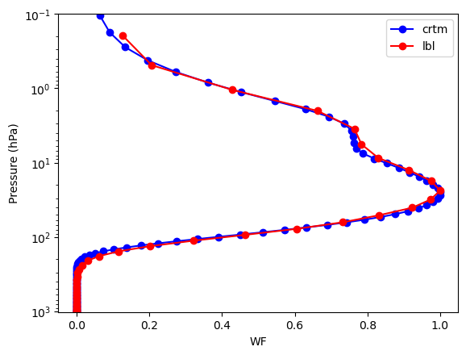

# lbl_gasabs
[](https://github.com/cd10kfsu/lbl_gasabs/actions/workflows/build_gfortran.yml)
[](https://github.com/MShawon/github-clone-count-badge)

**Online community**: [](https://discord.gg/FdFFUy9Zcc)

Author: Cheng Da  Email: cda@umd.edu



Don't know what you can do even after learning radiative transfer? Don't worry! Let's build a toy radiative transfer model from scratch! Exactly the same way how we learn data assimilation using the Lorenz-63 model.

This repo presents a simplified model for line-by-line calculation of gas absorption using HITRAN database.
It
1. assumes Lorentz line shapes
2. only considers CO2_626, H2O_161, O3_666
3. include examples for NOAA-18 HIRS channels.
4. utilizes openMP to accelerate calculation

## How to run the example
### Build the openMP-enabled executable (default)
1. Go to the directory `src`, edit file `compile_lbl.sh`:decomment line of `FOPTS` for openMP. Save & quit. Then run `./compile_lbl.sh` under `src`. An executable called `lbl.exe` will be generated.

### (optional) Build the serial-version
1. Edit file `compile_lbl.sh`:decomment line of `FOPTS` for the serial version. Save & quit.  Then run `./compile_lbl.sh` under `src`. An executable called `lbl.exe` will be generated, but do not have openMP enabled. 

### Run the calculation
2. Under `src`, run `./lbl.exe`. THe output will look like:
    ```
    &CONFIG
     FN_SOUNDING="../sounding.dat",
     FN_QTABLE="../parsum.dat",
     FN_SRF="../SRF/rtcoef_noaa_18_hirs_srf_ch01.txt",
     FN_GAS_H2O_161="../h2o/H2O_chan1.txt",
     FN_GAS_CO2_626="../co2/CO2_chan1.txt",
     FN_GAS_O3_666="../o3/O3_chan1.out",
     USE_H2O=T,
     USE_O3=F,
     USE_CO2=T,
     FAC_OVERSAMPLE=30         ,
     /
     enable OpenMP: nthreads =            8
     Skip O3_666.
     original SRF points=          91
     interpolated SRF points=        2730
     Finish SRF structure
     Finish loading atmospheric profile
     Finish loading absoprtion lines for H2O_161 (          35  lines).
     Finish loading absoprtion lines for CO2_626 (        1212  lines).
     Finish line OD & trans calculation
     Finish convolving SFR
     Finish WF calculation
     run time=  0.48611599998548627      seconds.
    ```
   The output will be in `fort.1000`, which includes pressure in the 1st column, and weighting function in the 2nd column. 
   From this diagnosis info, you can see that we are calculating transmittance due to gas absorption for **channel 1 (central wavelength: 14.966 microns) of HIRS onboard NOAA-18**. For the gas absorption, we include H2O, CO2, but **exclude O3**.

### Calculate other channels of N18/HIRS
1. Open `src/lbl.f90`, revise the following vars, and recompile & rerun:
   -  `FN_SRF="../SRF/rtcoef_noaa_18_hirs_srf_ch01.txt"`: where to find the spectral response function of inspected channel
   -  `FN_GAS_H2O_161="../h2o/H2O_chan1.txt"`: where to find the absorption line files for H2O of inspected channel. Used when `USE_H2O=.true.`
   -  `FN_GAS_CO2_626="../co2/CO2_chan1.txt"`: similar to `FN_GAS_H2O_161` but for CO2_626
   -  `FN_GAS_O3_666="../o3/O3_chan1.out"`: similar to `FN_GAS_H2O_161` but for O3_666
   -  `USE_H2O=.true.`: consider contribution of H2O to gas absorption if `true`
   -  `USE_O3=.false.`: similar to `USE_H2O` but for O3
   -  `USE_CO2=.true.`: similar to `USE_H2O` but for CO2
   Note that with the files included in this repo, you can calculate **N18/HIRS channels 1-7 with CO2,H2O included.**

## Repo Structure
1. We explain the repo strucutre and important files here:
   - `src`: Spectral response functions of N18/HIRS channels 1-19: `SRF/rtcoef_noaa_18_hirs_srf_ch[01-19].txt`
   - `h2o/co2/o3`: Gas absorption lines:
       - `h2o`: channels 1-7: `h2o/H2O_chan[1-7].txt`
       - `co2`: channels 1-7: `co2/CO2_chan[1-7].txt`
       - `o3`:  channel 1: `o3/O3_chan.out`
   - `plot`: plotting utilities:
       - `compare_crtm_lbl.m`: simple Matlab codes comparing WF calculated from our toy model and CRTM. **Note CRTM does not do LBL calculations for gas absorption**, but it serves our purpose here: we only want to make sure that the transmittance/WF from our simple model is realistic! You can easily convert it to Python
       - `crtm_wf.n18_hirs4`: sample output of N18/HIRS WF outputs for Channels 1-19. Pressure in the 1st column, and WF of channels in the following columns. Gas includes h2o & co2.

## What if you want to try some new sensors?
Generally you need to prepare:
- **Spectral response functions (SRFs) of the sensor**: Download the spectral response functions from the EUMETSAT NWP SAF: https://nwp-saf.eumetsat.int/site/software/rttov/download/coefficients/spectral-response-functions/
- **Gas absoprtion lines**: Download from the HiTRAN website: https://www.hitran.org
- **Atmosphere profile**: Prepare one as shown in `sounding.dat`

